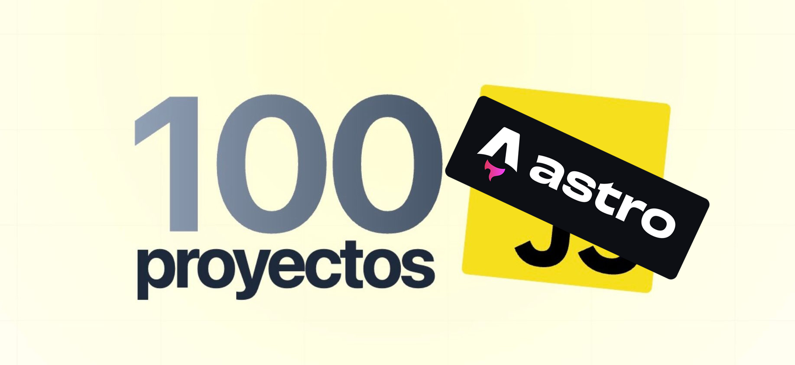

This repository contains 100 JavaScript projects recreated using Astro, based on the original work **[Javascript 100 Proyectos](https://javascript100.dev)** by [@midudev](https://midu.dev)

## 📦 Requeriments
- [NodeJS](https://nodejs.org) _v20.11.0_

## 💼 Projects

| #     | Project         | Description                                                               | Code    |
| :---: | --------------- | ------------------------------------------------------------------------- | :-----: |
| 001   | Tinder Swipe    | Aprende a crear el efecto de swipe de Tinder con HTML, CSS y JavaScript.  | 